# employee-tracker-sql

Simplified command line interface for an employee tracker system with postgresql backend.

## Description

Simplified command line interface for an employee tracker system with postgresql backend. The application runs on node.js, utilizes the inquirer package for the question and answer handling, and pg package for connection to a postgresql database. The sql code is done without ORM support at this time.

## Table of Contents

- [General Functionality](#general-functionality)
- [Screenshots](#screen-shots)
- [Installation](#installation)
- [Usage](#usage)
- [Credits](#credits)
- [License](#licensing)
- [Contributing](#contributing)
- [Testing](#testing)

### General Functionality

Provides the ability to be able to view and manage the departments, roles, and employees in my company so that I can organize and plan my business.

Provides a command-line application that accepts user input

The menu of functionality includes:

- view all departments:

  Produces a formatted table showing department names and department ids

- view all roles

  Produces a formatted output with the job title, role id, the department that role belongs to, and the salary for that role

- view all employees

  Produces a formatted output showing employee data, including employee ids, first names, last names, job titles, departments, salaries, and managers that the employees report to

- add a department

  The user is prompted to enter the name of the department and that department is added to the database

- add a role

  The user is prompted to enter the name, salary, and department for the role and that role is added to the database

- add an employee

  The user is prompted to enter the employee’s first name, last name, role, and manager, and that employee is added to the database

- update an employee role

  The user is prompted to select an employee to update and their new role and this information is updated in the database

- Update employee managers

  The user is prompted to select the employee to update along with the new manager. The update is saved to the database.

- View employees by manager.

  Presents a formatted output of managers and their direct reports

- View employees by department

  Presents a formatted output of departments with employees

- Delete departments, roles, and employees

  Deletes departments, roles, and employees if allowed via appropriate
  data integrity rules.

- View the total utilized budget of a department

  Presents a formatted output of departments and the cost of having employees without regard for the potential profit potential of said employees.

### Screen Shots

#### Initial Launch from Command Line

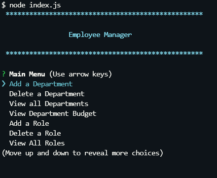

#### Add Department

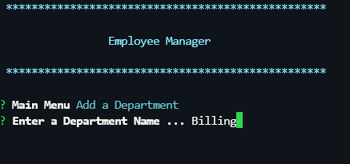

#### View Departments

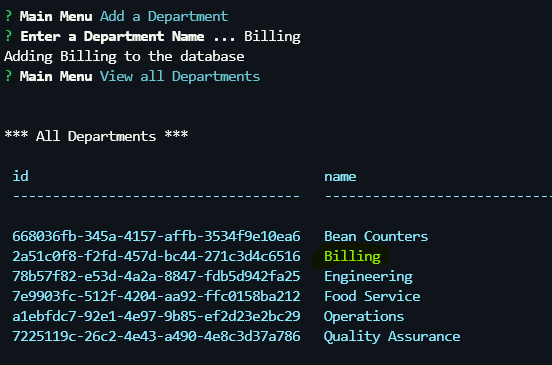

#### Delete Department

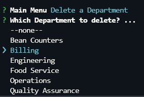

#### Add a Role

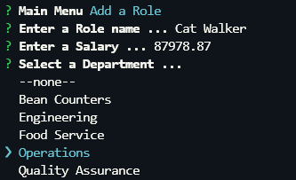

#### View Roles

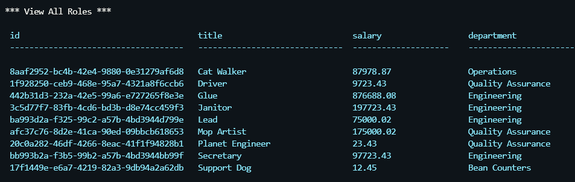

#### Delete Role

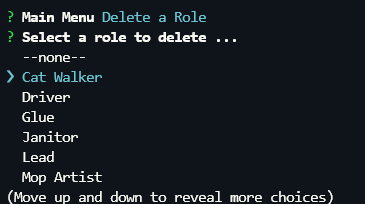

#### Add Employee

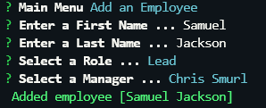

#### View Employees

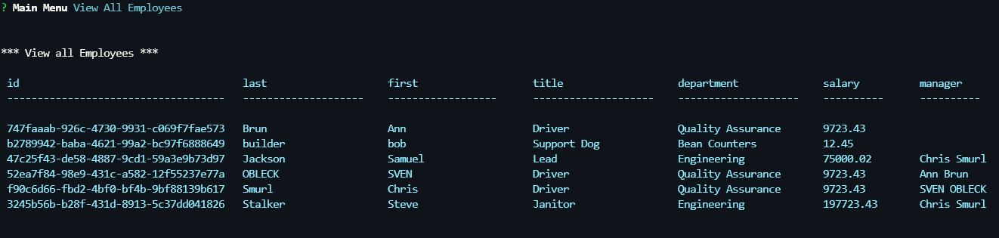

#### Delete Employee

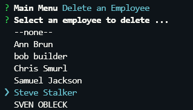

#### Update Employee Role

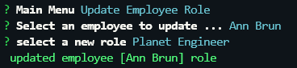

#### Update Employee Manager

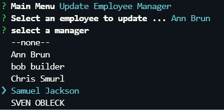

#### View Employee by Dept

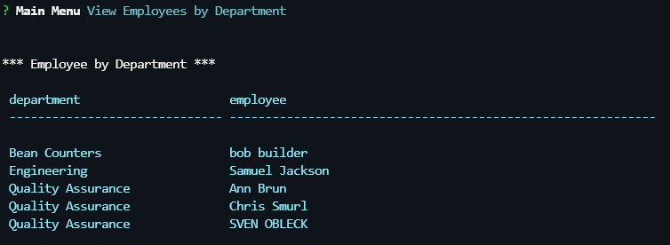

#### View Employee by Manager

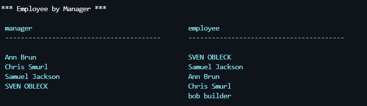

#### Department Budget

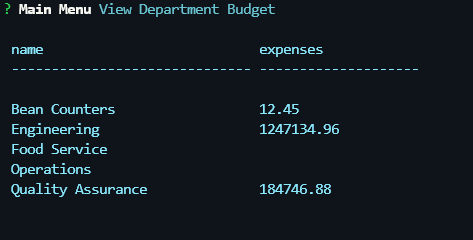

### Installation (manual)

1.  Install Node.js version 20.x or newer
2.  Clone https://github.com/ericroys-school/employee-tracker-sql.git
3.  `cd` into the `employee-tracker-sql` directory
4.  Run `npm i` to load all the project dependencies
5.  Install or have running an instance of postgresql (latest)
6.  Add your postgresql information to `.env.example` and then rename to `.env`
7.  Run the db/schema.sql file Via psql command line to create the database and tables
8.  Run the db/seed.sql file to load in demo data
9.  Run the program via `node index.js`

### Usage

As mentioned in the installation instructions, you run the program with `node index.js`. This will launch an interactive question and answer session.

You can watch a quick [video](https://drive.google.com/file/d/1_bH3lDHbPL57-R1iSOObwYw5daj69_Qc/view) on how the process works if you are not satisfied with the screenshots provided.

### Credits

No kittens, puppies, armadillos, otter, or octopi were harmed in the making of this project.

### Licensing

As per always, this repo is licensed with [The Unlicense](http://choosealicense.com/licenses/unlicense) so feel free to do whatever. Share with your kids, dogs, neighbors, mail carrier, etc. Have a nice day!

### Contributing

Feel free to reach out via email @ eric.roys@gmail.com if you are interested in contributions to the project or have any kindly suggestions for improvements and/or enhancements. Tanks, Sherman!
